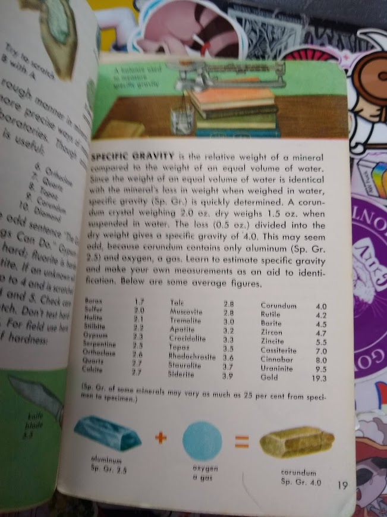
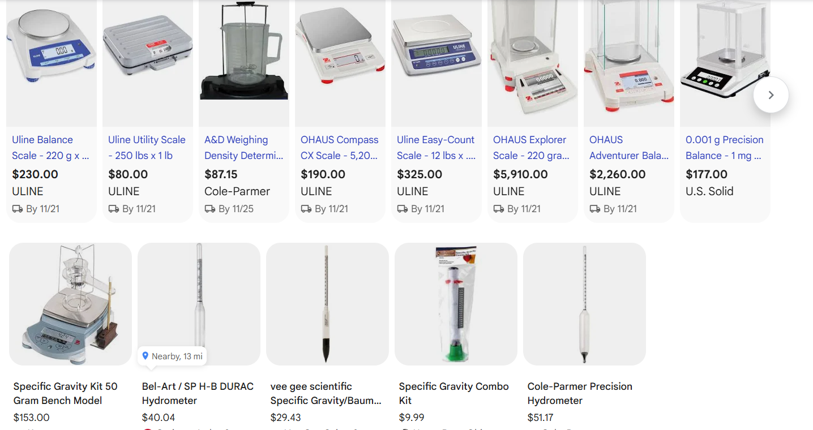

<h1>SpGr3D</h1>
<h2>An accessable specific gravity measurement tool for geologists</h2>
--------------------------------------------------------------------------------
<h2>What is Specific Gravity?</h2>

Simply put, specific gravity is a way for geologists to determine the density of different rocks by comparing their weight to the bouyant force water acts upon it.

<h2>How is Specific Gravity Calculated?</h2>
1. Measure the weight of the dry rock. (ex.w = 100g)
2. Measure the weight of the rock while it is in water. (ex.w = 75g)
3. Input your values into the formula (dry/(dry-wet))
4. (100/(100-75))=Sp. Gr.
5. (100/25)=Sp. Gr. = 4

<h2>Why is specific gravity important?</h2>

Specific Gravity is crucial to the process of geological identification as it allows one to 

<h3>My part in Specific Gravity</h3>

I first found out about specific gravity through my 1957 Rocks and Mineral Guide, which I always carry around with me (pictured below)This book happens to meantion specific gravity on page 19, which I have been wanting to measure while on my rock excursions and hikes, but i've run into a few problems...

<h2>The Issues...</h2>

When it comes to measuring specific gravity, you first need a device that will let you measure its weight in water and its weight in air. Now, I have a baking scale at home, but that doesn't quite fufil the job as well as I would like. For one, it is incredibly bulky to bring on me for my hikes where I'll typically want to pack light and can't measure its weight in water properly. Looking outside of baking scales, specific gravity measures usually range well above $100 in price and only have small hydrometers (tupically meant for liquid and not able to measure sizable rocks properly) available for use.

Now it's time to build a more accessable and portable device... follow the journey in my <a href="2journal.md">journal</a>!!!
